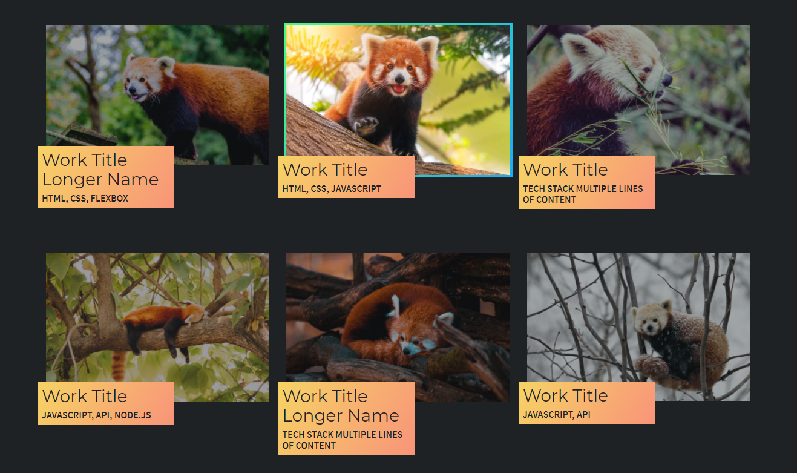

# portfolio-of-work
Portfolio website showcasing some of my work.

## :book: Table of Contents
1. [Objective](#objective)
2. [Feature](#feature)
3. [CSS Techniques](#css)
4. [Deployed Website](#deployed)

### :star2: Objective: 
Create a responsive portfolio website that demonstrates my CSS skills and showcases some of my code projects. 

### :sparkles: Feature: 
The image previews of the code examples are slightly transparent until you over over them. I included a gradient 'border' to help make the image pop out to the user's eyes.

### :mage_woman: CSS Techniques: 

* Flexbox
* CSS variables
* media queries
* gradients
* `:hover` transitions
* relative positioning
* social media icons
* box shadows

### :white_flower: Deployed Website: 

[Link to Portfolio Page](https://marina-russ.github.io/portfolio-of-work/)

Thank you for checking out my page!
